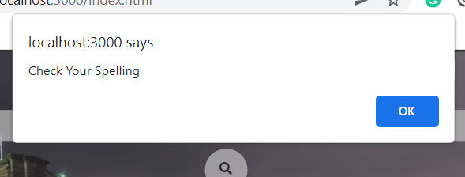

# CISC3140-LAB4
This is a simple demo of a weather app, which uses JavaScript's fectch syntax to access data from a weather api. It will display the following information temperature, weather description, humidity and wind speed.
You can use the following like to check out the website:
```bash
https://youthful-torvalds-eadb50.netlify.app/
```

## How to use this weather app
Type the name of the city into the search bar and it will automatically change the information that coorespond to the city


## Error
This pop up windoe will display when you type an incorrect city name

